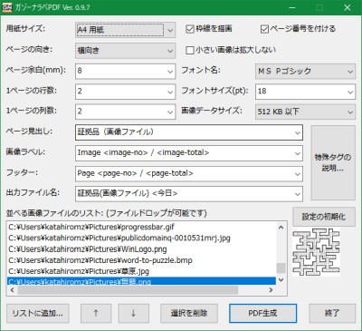

#  ガゾーナラベPDF by 片山博文MZ

「ガゾーナラベPDF」は、複数の画像を格子状に並べてPDFファイルにするソフトです。

基本操作は、画像ファイルをリストに追加して「PDF生成」ボタンを押すだけです。

完成したPDFファイルはデスクトップに作成されます。

## 対応環境

- 日本語 Windows XP/Vista/7/10/11

## 対応画像形式

- JPEG/PNG/GIF/TIFF/BMP/WMF/EMF/ICO/CUR
- Susieプラグインで読み込める画像ファイル (起動前にプラグインを同じフォルダに置いて下さい)

## 注意

- ユーザー名に機種依存文字が含まれている場合はサポート対象外です。
- Web標準ではないファイル形式には脆弱性がある恐れがあります。Susieプラグインの使用は推奨されません。

## 使用許諾

このプログラムは、試用期間のある300円（手数料等別途）のシェアウェアです。
継続して使用する場合はソフト配布サイトの [Vector（ベクター）](https://www.vector.co.jp) でお支払い下さい。
詳しくはファイル [LICENSE.txt](LICENSE.txt) をご覧下さい。

このプログラムを使って生じた如何なる損害も当方は責任を負いません。

## 連絡先

電子メール katayama.hirofumi.mz@gmail.com でご連絡下さい。

ホームページ：[https://katahiromz.web.fc2.com/](https://katahiromz.web.fc2.com/)
